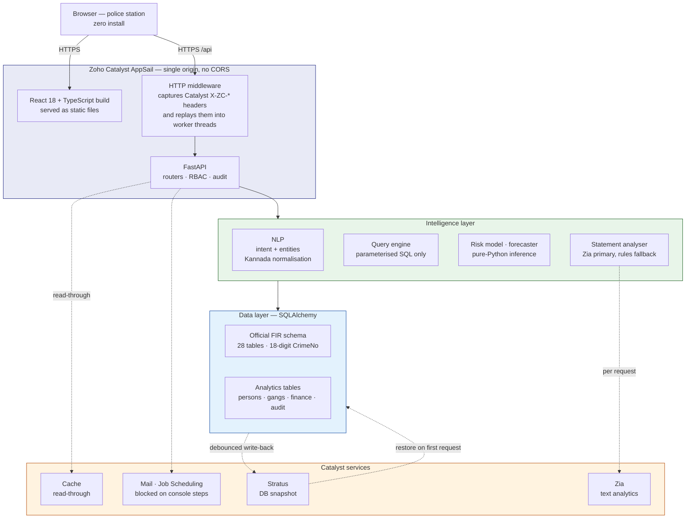

# KSP Crime AI

**Conversational crime intelligence for the Karnataka State Police.** Ask questions
of the state crime database in English or Kannada, register FIRs against the
official 28-table schema, and work the analysis a station actually needs — criminal
networks, offender risk, statutory custody deadlines, financial trails and
forecasting.

<p>


</p>

---

## Live deployment

**https://ksp-api-50044161264.development.catalystappsail.in**

| Sign in as | Password | Use it for |
|---|---|---|
| `investigator` | `invest@2024` | registering FIRs, statement analysis, case work |
| `supervisor` | `super@2024` | everything above, plus compliance and the audit log |
| `analyst` | `analyst@2024` | read-only analytics (cannot write, by design) |
| `admin` | `admin@2024` | platform diagnostics |

> Catalyst services only work on the deployed URL. Running locally there is no
> Catalyst gateway, so the SDK has no credentials and Zia, Stratus, Cache and Mail
> all decline — the app degrades to its documented fallbacks and says which engine
> answered. That is expected behaviour, not a fault.

### See the interesting part in 60 seconds

1. Sign in as `investigator / invest@2024`, open **REGISTER FIR**.
2. Paste this into *Complainant statement*:

   > On 14 August 2026 at about 9 PM, the complainant Ramesh Kumar was returning to
   > Jayanagar in Bengaluru when two men on a black Pulsar motorcycle snatched his
   > gold chain worth Rs 85,000 near the bus stand and fled towards Wilson Garden.
   > The accused Imran Shaikh was later identified.

3. Click **Analyse statement**.

Catalyst Zia reads the prose and returns both people, the vehicle, the stolen
property, the amount, the date and the time. The offence type, IPC section and
district come from this project's own Karnataka reference lists — Zia does not
classify offences, and the response says so. **Nothing is applied automatically:**
each result is a chip the officer clicks, because the legal classification of an
offence is an officer's act and the IPC section on an FIR ends up in front of a
court.

A blue **Catalyst Zia** pill means the model ran. An amber **Rule-based fallback**
pill means it did not, and the panel explains why.

---

## Contents

- [What problem this solves](#what-problem-this-solves)
- [Capability coverage](#capability-coverage)
- [Catalyst platform](#catalyst-platform)
- [Architecture](#architecture)
- [Features](#features)
- [Getting started](#getting-started)
- [Configuration](#configuration)
- [API reference](#api-reference)
- [Testing and verification](#testing-and-verification)
- [Deployment](#deployment)
- [Measured models](#measured-models)
- [Security](#security)
- [Data provenance](#data-provenance)
- [Documentation index](#documentation-index)
- [Roadmap](#roadmap)

---

## What problem this solves

A crime database answers the question you knew how to ask. An investigator asking
*"which areas are seeing the most chain snatching, and who's been arrested there
before?"* has to become an SQL author first, so most of the value in the data is
reachable only by whoever happens to know the schema.

This platform closes that gap in three ways:

1. **Natural language in, parameterised SQL out.** Questions in English or Kannada
   become `{intent, entities}`, which a deterministic query engine executes. The
   language layer never writes SQL, so answers stay injection-safe and auditable.
2. **Analysis the data supports but nobody has time to run** — co-accused networks,
   repeat-offender risk, socio-demographic correlation, seasonal patterns,
   statutory custody deadlines.
3. **An operational screen, not just analytics.** `COMPLIANCE` answers the question
   a station actually opens a system for: which of my cases breaches a statutory
   chargesheet deadline, and when.

---

## Capability coverage

The six scored capabilities are documented in **[CAPABILITIES.md](CAPABILITIES.md)**,
which states for each one what is implemented, where to see it, and **what it does
not do**. That last column is the point — a capability map with no gaps in it is a
marketing document.

| # | Capability | Primary screens |
|---|---|---|
| C1 | Advanced visualization | `DASHBOARD` `MAP` `FORECAST` `COMPLIANCE` |
| C2 | Criminological network & link analysis | `NETWORK` |
| C3 | Sociological & AI-driven predictive dashboards | `INSIGHTS` `PROFILES` |
| C4 | Pattern & trend discovery | `FORECAST` `MAP` `DASHBOARD` |
| C5 | Network & behavioural analysis | `PROFILES` `CASE INVESTIGATION` `NETWORK` |
| C6 | AI/ML-driven intelligence | `PROFILES` `FORECAST` `AI ASSISTANT` `REGISTER FIR` |

Beyond the six, the platform implements the **official Karnataka Police FIR schema**
— 28 normalised tables (`CaseMaster`, `Victim`, `Accused`, `ComplainantDetails`,
`ArrestSurrender`, `ChargesheetDetails`, `Act`/`Section`, `CrimeHead`/`CrimeSubHead`
and lookup masters) with the official 18-digit `CrimeNo`. See
[`models_fir.py`](backend/src/database/models_fir.py) and the projection ETL
[`migrate_to_fir_schema.py`](backend/migrate_to_fir_schema.py).

---

## Catalyst platform

Everything runs on Zoho Catalyst. **`GET /api/system/services`** publishes a live
inventory: every service with a status, the call site a reviewer can open, and where
it is not working, the exact reason.

**Status is derived from observed operations, never from configuration.** A service
is reported `live` only once a call has actually succeeded in that instance. This
matters because the commonest way to overstate a platform is to set an environment
variable and call the service "integrated".

| Service | Status | What it does here |
|---|---|---|
| **AppSail** | `live` | Hosts the FastAPI app and serves the React build from the same origin — no CORS, no gateway preflight |
| **Stratus** | `live` | Persists the SQLite database. `/tmp` is wiped on restart, so the file is snapshotted to object storage after each write and restored on the first request after a restart |
| **Cache** | `live` | Read-through cache over the three most expensive analytical endpoints. Every response names which tier answered |
| **Zia Text Analytics** | `live` | NER, keyword extraction and sentiment over the complainant statement typed during FIR registration |
| Static web hosting | `platform` | Via AppSail; the React build is served by the same process as the API |
| **Mail** | `not-configured` | Custody-clock digest. Built and attempted; Catalyst returns `INVALID_ID: No such from_email` — the sender must be registered in the console |
| **Job Scheduling** | `not-configured` | Daily digest cron targeting this AppSail deployment. Code complete and tested; the project has no jobpool, which only the console can create |
| **SmartBrowz** | `not-available` | Server-side PDF rendering. Called for real and refused with `INVALID_ID: No such User` for every request, including an empty test document — so the report endpoint serves a print-laid-out A4 HTML page instead and names the reason in a response header |
| File Store | `not-configured` | Accessor present; no feature depends on it yet |
| Data Store + ZCQL, Catalyst Auth, QuickML, Zia OCR/Face, NoSQL, Search, Push, Circuits | `not-used` | Each listed with its reason. ZCQL is not a SQL wire protocol, so adopting Data Store is a rewrite of every model and query rather than a migration |

**14 services listed, 4 live, 9 with call sites.** Three are built but blocked —
two on a Catalyst console step, one on account provisioning. The inventory quotes
the API's own error for each, and distinguishes `not-available` (called and refused)
from `not-configured` (a prerequisite we can fix) from `not-used` (a choice we made).

Two diagnostic endpoints exist because the Python SDK's documentation pages return
404, and guessing at SDK behaviour cost this project several defects:

- `GET /api/system/catalyst-probe` — which `X-ZC-*` headers AppSail actually
  forwards, and that `initialize()` fails while `initialize(req=request)` succeeds.
  Credential values are never returned, only presence and length.
- `GET /api/system/zia-probe` — Zia's raw, unmodified responses, so the shapes
  could be read off a real reply before any feature was built on them.

`CAPABILITIES.md` records what each of those cost to establish, including two
claims this documentation previously got **wrong** and has since corrected.

---

## Architecture



Three design decisions worth calling out:

**Single origin.** The React production build is copied into `backend/static` and
served by the same FastAPI process that exposes `/api/...`, so the browser makes
same-origin calls. This sidesteps the Catalyst gateway intercepting CORS preflight
requests.

**The language layer never touches the database.** An LLM or rule engine converts
text to `{intent, entities}`; the existing parameterised query engine executes it.
Queries stay injection-safe and every answer carries an evidence trail.

**Persistence is a whole-file snapshot, and honest about its limits.** AppSail's
`/tmp` is writable but wiped on restart, so the SQLite file is snapshotted to
Stratus after each write and restored on the first request after a boot. Because
the file is the unit of transfer, this is **single-instance**: with more than one
running instance the last writer wins. PostgreSQL via `DATABASE_URL` remains
supported and is the production scale-out route. `GET /api/system/info` reports
which mode is active and whether the round trip has actually been observed.

### Repository layout

```
backend/
├── main.py                        FastAPI app, routers, startup, Catalyst middleware
├── generate_narrative_data.py     seeds crimes, persons, gangs, FIRs, money trails
├── migrate_to_fir_schema.py       projects data into the official FIR schema
├── src/
│   ├── api/
│   │   ├── auth.py                tokens, PBKDF2, require_role(), scheduler token
│   │   └── routes/                chat, crimes, stats, network, hotspots, insights,
│   │                              decision_support, compliance, casework, audit, system
│   ├── database/                  models.py (analytics) · models_fir.py (official)
│   ├── nlp/                       intent_classifier · followup · kannada_support
│   ├── query_engine/              translator.py — intent to safe SQL
│   ├── ml/                        risk_model · forecast_model · features
│   └── services/
│       ├── catalyst.py            honest SDK wrapper — records why, never raises
│       ├── catalyst_store.py      3-layer SQLite persistence via Stratus
│       ├── cache.py               read-through cache, gzip envelope
│       ├── narrative.py           statement analysis — Zia merged with local canon
│       ├── compliance.py          custody clock, pendency, stations, officers
│       ├── digest.py              custody-clock mail digest
│       ├── report_html.py         shared renderer — digest and PDF cannot drift
│       ├── report_pdf.py          downloadable compliance report
│       └── service_inventory.py   the auditable Catalyst service map
└── tests/                         75 pytest cases
frontend/src/
├── pages/ChatPage.tsx             shell + conversational interface
├── components/                    Dashboard · NetworkView · HotspotView · InsightsView
│                                  ProfilesView · FinanceView · ForecastView
│                                  ComplianceView · RegisterFIRView · CaseInvestigation
│                                  AuditView · Login
├── api.ts                         API base, token, authenticated fetch
└── locale.ts                      Kannada localisation of data and answers
```

---

## Features

**Conversational interface** — natural-language queries in English and Kannada,
voice input, context-aware follow-ups (*"and in Mysuru?"*, *"who was the accused?"*),
and conversation export to PDF. Every reply carries a **"Why this answer?"** trail:
intent, confidence, filters applied, records examined, and which engine parsed the
question.

**FIR registration with statement analysis** — a role-gated form covering all
**31 Karnataka districts** with real police stations: crime details, an interactive
Leaflet map picker (click, landmark autocomplete or GPS) for the exact location,
investigating officer with rank and designation, accused photographs, and gang
tagging. Generates the official 18-digit `CrimeNo`, mirrors into `CaseMaster`, and
flows straight into every analytical view. A soft **jurisdiction warning** flags a
pin outside the selected district (Zero-FIR aware). Catalyst Zia reads the
complainant statement and proposes structured fields for the officer to confirm.

**Case compliance and pendency** — the custody clock: cases where an accused is in
custody and no chargesheet is filed, with days remaining against the statutory
period. The BNSS 60/90-day rule lives in **exactly one function**, called by this
screen, the mail digest and the downloadable report, so the three can never disagree
about a deadline. Investigation pendency is reported **separately and labelled**,
because it carries no automatic legal consequence.

**Downloadable compliance report** — `GET /api/compliance/report.pdf` returns the
whole picture laid out for A4, built from the same cached payload the JSON endpoint
serves, so the document cannot disagree with the screen it came from.

**Criminal network analysis** — a radial hub-and-spoke graph grounded in real
co-accused cases: the focus person at the centre, direct links on an inner ring and
second-degree links on an outer ring. Every edge traces to the actual linking
`CrimeNo`, shown on hover. Registering an FIR with multiple accused auto-creates the
links; gang tagging feeds organised-crime clustering.

**Case investigation** — enter a `CrimeNo` for the full dossier: accused, victims,
incident coordinates with an embedded map and directions, and police, officer and
court details from the official schema. Investigators can advance investigation
status; supervisors and admins can close a case (two-tier RBAC).

**Offender profiling** — repeat-offender ranking with an explainable 0–100 risk
score, primary modus operandi and full case history, drillable from any accused.

**Hotspot map** — geographic distribution with district hotspots and 90-day
emerging-surge alerts.

**Sociological insights** — accused breakdown by age, gender, socio-economic
status, education, occupation and urban/rural, plus social-risk-factor correlations.

**Decision support** — automated case summaries, timelines, investigative leads and
similar-case matching with outcomes.

**Financial analysis** — suspicious money-trail tracing, layering detection and
per-account aggregates. Labelled as a demo integration; production would connect to
bank or FIU-IND feeds.

**Forecasting and trends** — next-month projection with an 80% interval, district
early-warning alerts, and seasonal plus festival-window analysis.

**Legal-section queries** — ask by section (*"cases under IPC 302"*, *"section 379
in Mysuru"*, *"u/s 420"*) and the engine maps it to the offence type.

**Governance** — HMAC-signed tokens, PBKDF2 password hashing, four operational
roles with per-tab and per-action authorisation, and a persisted, supervisor-visible
audit log.

---

## Getting started

### Prerequisites

- Python 3.11+ and Node.js 16+
- Optional: [Ollama](https://ollama.com) with `qwen2.5:3b` for the local-LLM path

### Backend

```bash
cd backend
pip install -r requirements.txt
python main.py            # http://localhost:8004
```

First boot seeds the dataset and projects it into the official FIR schema
automatically when the database is empty. To do it explicitly:

```bash
python generate_narrative_data.py   # crimes, persons, gangs, FIRs, finance
python migrate_to_fir_schema.py     # project into the official FIR schema
python src/nlp/train_model.py       # train the intent classifier
```

### Frontend

```bash
cd frontend
npm install
npm start                 # http://localhost:3000
```

> **Catalyst services are unavailable locally.** The SDK builds its credentials
> from headers the AppSail gateway attaches to each request, and there is no gateway
> on `localhost`. Zia, Stratus, Cache and Mail therefore decline, and each feature
> falls back to its documented alternative while naming which engine answered. To
> exercise the Catalyst path, use the deployed URL.

---

## Configuration

Backend configuration is environment-driven; see [`backend/.env.example`](backend/.env.example).
For the deployed app these live in `app-config.json`, which is **gitignored** because
it carries secrets — copy [`app-config.example.json`](app-config.example.json), which
documents every variable.

| Variable | Default | Purpose |
|---|---|---|
| `DATABASE_URL` | SQLite (dev) | `sqlite:////tmp/ksp_crime_ai.db` on AppSail, paired with `KSP_STRATUS_BUCKET`. A PostgreSQL URL also works and is the scale-out route |
| `KSP_STRATUS_BUCKET` | — | Catalyst Stratus bucket holding the database snapshot. Without it, ephemeral SQLite would silently lose every write, and `deploy.ps1` refuses to deploy |
| `KSP_AUTOSEED` | `true` | **Set `false` in production** so real data is never re-seeded |
| `KSP_SECRET_KEY` | dev value | Token signing secret. Must be overridden: `python -c "import secrets; print(secrets.token_hex(32))"` |
| `KSP_JOB_TOKEN` | empty | **Second authentication path — read before setting.** Shared secret letting a Catalyst cron call the digest endpoint. Accepted on that one route only, constant-time compared. Empty disables the scheduled digest entirely |
| `KSP_DIGEST_HOUR` | `7` | Local hour (Asia/Kolkata) for the daily digest cron |
| `MAIL_FROM` / `KSP_DIGEST_TO` | empty | Catalyst Mail sender and recipients. The sender must be **registered in the Catalyst console** or delivery is rejected |
| `KSP_NLP_PROVIDER` | `ollama` | `rules` in the cloud, since Ollama cannot run on Catalyst |
| `KSP_AUTH_REQUIRED` | `true` | `false` for local demos only |
| `KSP_EXPOSE_SQL` | `false` | Expose generated SQL. Debug only |
| `KSP_CACHE_SEGMENT_ID`, `KSP_FILESTORE_FOLDER_ID` | empty | Optional Catalyst resources |

`deploy.ps1` refuses to deploy on a bad configuration: a placeholder or short
signing key, ephemeral SQLite with no Stratus bucket, autoseed left on, or a
`KSP_JOB_TOKEN` that is short, a placeholder, or a duplicate of the signing key.

Frontend: `REACT_APP_API_BASE` — empty means same-origin, which is what the
production build uses.

---

## API reference

| Method | Path | Auth | Purpose |
|---|---|---|---|
| `POST` | `/api/login` | — | Authenticate; returns a signed token |
| `POST` | `/api/chat` | any role | Conversational query, follow-ups, case summary |
| `POST` | `/api/narrative/analyse` | register roles | **Statement analysis via Zia**, with a rule-based fallback |
| `POST` | `/api/crimes` | register roles | Register a new FIR |
| `PATCH` | `/api/crimes/{crimeNo}` | investigator/supervisor/admin | Advance status or close a case |
| `PATCH` | `/api/person/{id}/photo` | register roles | Add or replace an accused photograph |
| `GET` | `/api/crime/{crimeNo}` | any role | Full case dossier |
| `GET` | `/api/stats` | any role | Dashboard analytics |
| `GET` | `/api/network/overview`, `/search`, `/person/{id}` | any role | Co-accused network and offender search |
| `GET` | `/api/hotspots`, `/api/patterns/mo`, `/api/trends/seasonal` | any role | Hotspots, modus operandi, seasonal trends |
| `GET` | `/api/sociological` | any role | Demographic and social-risk insights |
| `GET` | `/api/offenders`, `/api/offenders/{id}` | any role | Risk-ranked profiles |
| `GET` | `/api/cases/{fir}/summary`, `/similar` | any role | Decision support |
| `GET` | `/api/clearance`, `/api/officer-caseload` | any role | Arrest/clearance rates, caseload |
| `GET` | `/api/financial/trails` | any role | Money-trail analysis |
| `GET` | `/api/forecast`, `/api/model/metrics` | any role | Forecast, early warning, model metrics |
| `GET` | `/api/compliance/report` | any role | Custody clock, pendency, stations, officers |
| `GET` | `/api/compliance/report.pdf` | any role | **The same report as a document** |
| `GET` | `/api/compliance/custody-clock`, `/stations` | any role | Individual compliance views |
| `GET` | `/api/compliance/digest` | any role **or** scheduler token | Custody digest; `?send=true` delivers |
| `GET` | `/api/audit` | supervisor/admin | Audit log |
| `GET` | `/api/system/info` | any role | Database backend and whether persistence is **observed** |
| `GET` | `/api/system/services` | any role | **The auditable Catalyst service inventory** |
| `GET` | `/api/system/catalyst-probe`, `/zia-probe` | any role / admin | SDK diagnostics |
| `GET` | `/api/system/jobs` · `POST /api/system/jobs/digest` | admin | Inspect and create the digest schedule |

Interactive schema: [`/docs`](https://ksp-api-50044161264.development.catalystappsail.in/docs)
on the deployed app.

---

## Testing and verification

```bash
cd backend
python -m pytest tests -q          # 75 tests
```

> Use `python -m pytest tests`, not bare `pytest` — the latter walks
> `backend/vendor/` and dies collecting SQLAlchemy's own test suite.

The suite covers auth and RBAC, the query flows including Kannada, the Catalyst
wrappers and their fallbacks, Zia response parsing against fixtures copied verbatim
from a live probe, the scheduler token, HTML escaping, and — unusually — **the
truthfulness of the service inventory**. Two of those tests exist because two
inventory reason strings were once false; a wrong reason in an honesty document is
worse than an admitted gap.

### Verification harnesses

Claims about a deployed system should be checkable, so the checks are committed:

| Script | Verifies |
|---|---|
| `verify_endpoints.ps1` | Every endpoint, driven off the served `/openapi.json` so the list cannot drift. 37 endpoints plus the React bundle |
| `verify_deploy.ps1` → `deploy.ps1` → `verify_restart.ps1` | The persistence round trip: register an FIR, redeploy (wiping `/tmp`), confirm the FIR survived |
| `verify_narrative.ps1` | Zia answers on the real request path and the inventory reports it live |
| `verify_jobs.ps1` | The scheduler token authenticates the digest, a wrong token is refused, and it opens no other route |
| `verify_services.ps1` | The service map, and that cached endpoints report their tier |
| `verify_deploy_guard.ps1` | `deploy.ps1` blocks bad configurations. Runs against temporary copies; never touches the real config |
| `zia_probe.ps1`, `probe.ps1` | Raw SDK responses |

---

## Deployment

The platform runs as a **single Catalyst AppSail service**: one FastAPI process
serves both the React build and `/api/...`, so stations need only a browser and
there are no CORS or preflight issues.

```powershell
./deploy.ps1
```

Five stages: validate configuration, build the React app, copy it into
`backend/static`, verify every dependency is vendored, deploy. It fails loudly
rather than reporting success over a failed deploy, and it checks the Catalyst CLI
is logged in first — a stale session otherwise reports itself as
`Org and Project Id cannot be empty`, which reads like a configuration error.

Notes specific to AppSail:

- It does **not** run `pip install` on the server, so Linux `manylinux` wheels are
  vendored into `backend/vendor` (`vendor-deps.ps1`, keyed on a hash of
  `requirements.txt` so a new dependency re-vendors automatically).
- `main.py` binds to `X_ZOHO_CATALYST_LISTEN_PORT`.
- `KSP_NLP_PROVIDER=rules` in the cloud; the heavy ML stack is optional, and both
  models ship as coefficients for pure-Python inference.
- SQLite on `/tmp` **plus a Stratus bucket** is the supported configuration.
  Bare ephemeral SQLite is rejected by the deploy guard.

Full guide including CLI setup and troubleshooting: **[DEPLOYMENT.md](DEPLOYMENT.md)**.
Docker artifacts are provided for container or VM hosting as an alternative.

---

## Measured models

Both report an honest metric and run as pure Python at inference time.

| Model | What it does | Validation | Result |
|---|---|---|---|
| Offender risk | Ranks repeat offenders by reoffence risk | Held-out test split | ROC-AUC **0.992**, accuracy **0.977** |
| Crime-volume forecast | Projects next month's incident count | Walk-forward one-step-ahead backtest over 16 held-out months | Reported live; typically 15–25% lower MAE than a naive baseline |

The forecaster is *selected* by the backtest: ten candidates (naive, moving
averages, drift, seasonal naive, linear trend, damped trend, SES, Holt damped) are
each scored one-step-ahead and the lowest-MAE method wins. The in-progress calendar
month is excluded so a partial count cannot drag the trend down, and the point
forecast carries an 80% interval derived from measured backtest RMSE rather than an
assumed variance.

> **The forecast row is deliberately not a fixed number.** Which method wins depends
> on the seeded series, which regenerates relative to the current date — across three
> re-seeds it selected `holt_damped`, `ma_trend` and `holt_damped` at MAE 10.18, 9.11
> and 8.18. Quoting one as *the* result would be stale within a day. `GET /api/forecast`
> reports the live figures. The offender-risk figure is stable because that model is
> trained once and its metrics are stored beside it in `backend/models/risk_model.json`.

Simple models are deliberate: with roughly two years of monthly history a
high-capacity model would overfit, and a measured error against a baseline is more
defensible than an unvalidated complex one. Both surface their metrics in the UI
next to the numbers they produce.

---

## Security

- **Parameterised SQL throughout.** The language layer never generates SQL.
- **PBKDF2-HMAC-SHA256 password hashing**, HMAC-SHA256 signed session tokens,
  constant-time comparison.
- **Four roles** with per-tab and per-action authorisation. Analysts and
  policymakers are read-only; only supervisors and admins can close a case.
- **Persisted audit log**, visible to supervisors.
- **HTML escaping** on every value interpolated into the mail digest and the
  downloadable report.
- **One additional authentication path**, and it is deliberately narrow: a Catalyst
  cron cannot hold a session, so the digest endpoint also accepts a shared secret in
  `X-KSP-Job-Token`. It is not a reusable dependency, it is off unless configured,
  it enforces a 32-character minimum in the backend as well as the deploy script,
  and the principal it returns cannot satisfy any role check. Tests assert it opens
  no other route and that no endpoint ever echoes it.
- **On-premise capable.** The optional LLM path runs on infrastructure you control,
  so sensitive text need not leave government systems.

---

## Data provenance

**All data is synthetic. Nothing here represents a real person or case.**

District and offence-type mixes live in
[`karnataka_crime_reference.json`](backend/data/reference/karnataka_crime_reference.json),
where each block records its own `basis` and `source`. They are labelled
**illustrative** — chosen to be plausible, *not* derived from published crime
statistics. One association is planted deliberately: the age–crime curve, the most
robust finding in criminology. [CAPABILITIES.md](CAPABILITIES.md) states which
patterns are real signal and which are artefacts of the generator, because a
sociological insight drawn from invented data is a demonstration of the pipeline,
not a finding about Karnataka.

---

## Documentation index

| Document | Contents |
|---|---|
| **[CAPABILITIES.md](CAPABILITIES.md)** | The six scored capabilities, each with its gaps stated. Platform section, what the SDK cost to establish, and what is not working and why |
| **[DEMO.md](DEMO.md)** | Scripted walkthrough for a recording: which screen evidences which capability, with timings |
| **[DEPLOYMENT.md](DEPLOYMENT.md)** | Catalyst CLI setup, wheel vendoring, environment variables, troubleshooting |
| **[DATABASE.md](DATABASE.md)** | Schema, the persistence design, and connection pooling |
| [docs/ARCHITECTURE.md](docs/ARCHITECTURE.md) | Layer-by-layer detail |
| [docs/api_contract.md](docs/api_contract.md) | Request and response shapes |
| [docs/intent_taxonomy.md](docs/intent_taxonomy.md) | Supported intents and entity grammar |

---

## Roadmap

- **Load real KSP data.** The official schema is ready to receive it; financial,
  gang and demographic data are currently synthetic.
- **Zia OCR on scanned complaints.** Zia ships an Aadhaar-specific OCR model, which
  is a natural fit for populating a person record from an identity document. It needs
  a file-upload path and real scanned documents.
- **Multi-instance persistence.** The Stratus snapshot is single-instance by design;
  PostgreSQL is the scale-out route and is already supported.
- **Move accused photographs** out of database blobs into Catalyst File Store.
- **Unify victims, locations and financial accounts** into the network graph.
- **Broaden the automated suite** over the newer analytical endpoints.

---

## Acknowledgments

Built for the Karnataka State Police conversational-crime-intelligence challenge.
Synthetic data only — no real PII.
